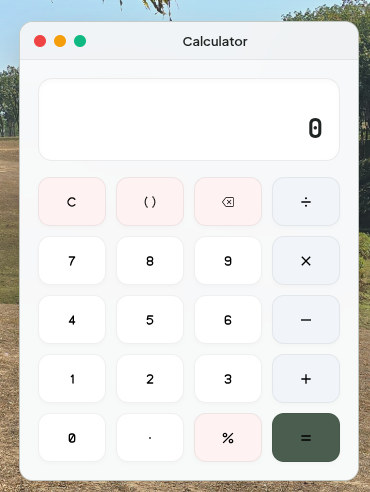
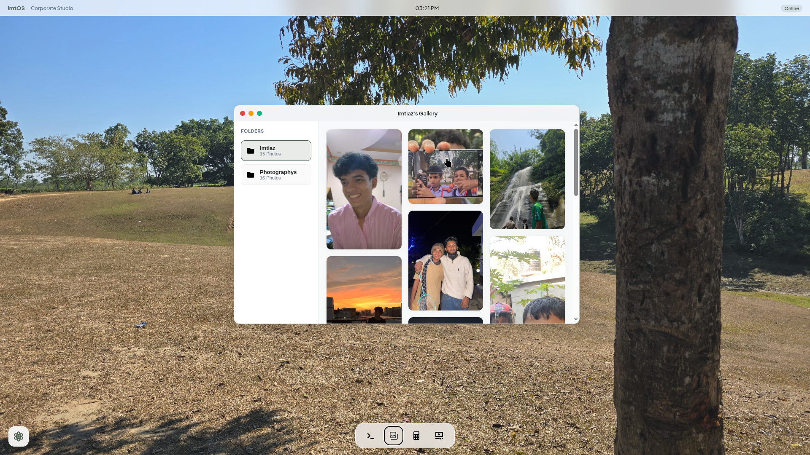
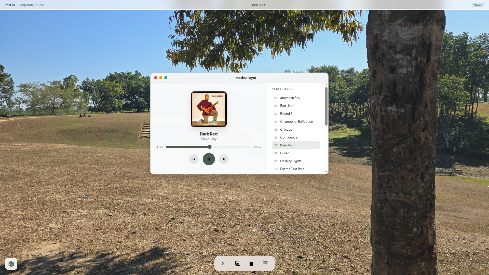
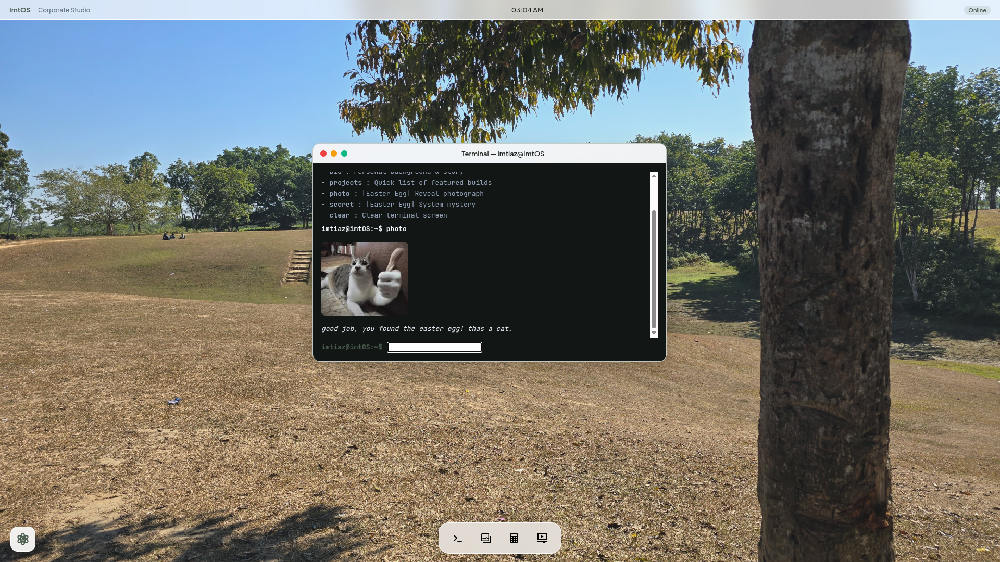
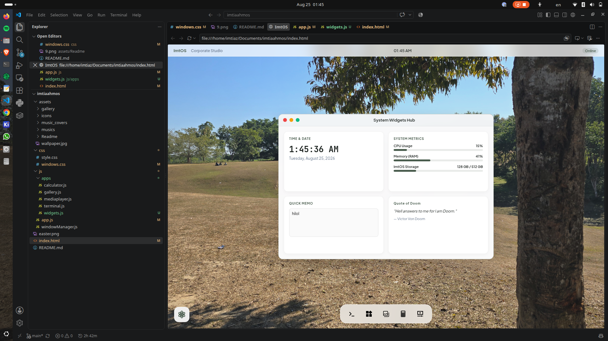
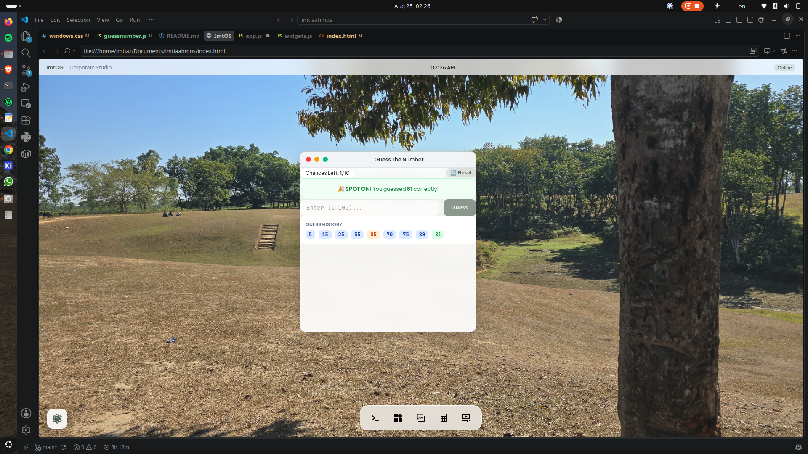

# ImtOS by Imtiaz Ahmed

Yo, It's Imtiaz Ahmed, 15, building **ImtOS**, which is basically a WebOS that can be run on browser.
Using ImtOS, you can easily get to know me! That starts now!

## Day-1, Aug 4, 2026.

**Log-1, Hackatime Coding Session: 19Minutes**

Today, i created the main thing where everything will be shown, the **index.html** file. In this ImtOS, we gonna have 4 different applications.
They are
- **Calculator**
- **Gallery**
- **Media Player**
- **Terminal (CLI)**

As you can see in the picture given above, i created the base. There will be a dock with 4 svg icons that represents those 4 applications. There will also be an atom icon which I made myself will work as an application centre. In the next mission, I'm thinking of adding more features without bothering the dock, so those apps will go here.

**Log-2, Hackatime Coding Session: 21Minutes**

Now, I created the **windowManager.js**. It's crucial cause while using the OS and its features, the OS creates Windows. Although we haven't designed the OS or styled it yet, it's so important, cause without it, i can't create any windows. 
So, now I'll create the **style.css** file.

**Log-3, Hackatime Coding Session: 39Minutes**

I've created the **style.css** file and designed the dock and the application centre. I also designed the top header that says ImtOS - Corporate Studio and how it'd react. That's it all in **style.css**, now it's time to create some actual apps. Starting with the **calculator** app.

**Log-4, Hackatime Coding Session: 83Minutes**

As you can see in the given picture above, the calculator looks hella odd. I created **windows.css** and **calculator.js** for that. But, It was looking that and it was pissing me off. It wasn't even draggable. And It had no bar in it. Then I created an whole section in **style.css** for window and that lwk worked.

This worked. Now, you may be thinking that why are you gonna use the calculator function in ImtOS when you have a calculator in your hand or calculator app in your device. This is a great question to think. So great even idk the answer.

Whatever, use it or don't, this feature is awesome (pls say yes).

**Log-5, Hackatime Coding Session: 6Minutes**

Trust me this took way more than 6 minutes. I kinda hate texts, so i replaced the text buttons with SVG files. Nothing else. Now, time to do the gallery one.

**Log-6, Hackatime Coding Session: 55Minutes**

This took way more than 55 Minutes, like collecting the photos and arranging them, designing the whole gallery.
Whatever, here you go, now you can have a watch on the owner of ImtOS and his nice lovely photographys.

**Log-7, Hackatime Coding Session: 70Minutes**

Well, here we go with our media player. Actually it's an MP3 player with some dedicated song (which are my favs :3). Now who would come to ImtOS and listen to this songs? ITS YOU!!! YOU WILL COME IN IMTOS AND LISTEN TO MY MASTERPIECE MUSIC TASTE.

try it out, now!

## Day-2, Aug 5, 2026.

**Log-8, Hackatime Coding Session: 30Minutes**

As you can see, I added terminal and some easter eggs like this cat giving the thumbs emoji. Lol

Here, it ends our journey in only 2 days making ImtOS that can represent me, yo!

# Conclusion

Here, we get our ImtOS made by me, Imtiaz Ahmed. I made this project as a mission of Hack Club Stardance named WebOS1. In the next mission, I'll add more games and features in ImtOS, that can make it standup.
I used my favourite picture as the wallpaper of ImtOS, so that's a good thing. I also kept it MacOS aesthetics type, even though i use Ubuntu.

I tried to keep some easter eggs here, as in terminal,

**System Commands:**
- **whoami** : Display user identity & role.
- **bio** : My interest, nothing else.
- **projects** - I'll add them later.
- **photo** - [Easter Egg] Reveal a photo.
- **secret** - [Easter Egg] Elite ball knowledge.
- **clear** - Clear terminal screen.

added them just for fun, they maybe dont make any sense lol.

In Media player, well I wouldn't call it media player, its an MP3 player, that runs some songs. But I'll add a whole media feature in it in WebOS2 Mission!

I added 22 songs here, they are-
- **American Boy** by Kanye West
- **Bad Habit** by Steve Lacy
- **Bound 2** by Kanye West
- **Chamber of Reflection** by Mac Demarco
- **Chicago** by Michael Jackson
- **Confidence** by Kim
- **Dark Red** by Steve Lacy
- **Duvet** by Boa
- **Flashing Lights** by Kanye West
- **For The First Time** by Mac Demarco
- **From The Start** by Laufey
- **Ginseng Strip 2002** by Yung Lean
- **Headlock** by Imogen Heap
- **I Wonder** by Kanye West 
- **Ice** by Zertal
- **Let it Happen** by Tame Impala
- **Like Him** by Tyler, The Creator
- **Lover Girl** by Laufey
- **New Person, Same Old Mistakes** by Tame Impala
- **See You Again** by Tyler, The Creator
- **Tek It** by Cafune
- **The Less I Know The Better** by Tame Impala

make sure to listen to them, they are my favs!

I also added a gallery app, that features my 2 album, one named Imtiaz and other named Photographys. Make sure to check em.

## Time Spent on ImtOS: 5Hour 56Minutes

# ImtOS V2 by Imtiaz Ahmed

**Log-9, Hackatime Coding Session: 121Minutes**

So, here I am on the next mission of Stardance and It's WebOS2! I'm so happy my project got approved and this is me doing it again. So, In this log, I made a widget on ImtOS as you can see in the picture above. 

I added 4 things. They are-
- **Time And Date** - shows real time date and time.
- **System Metrics** - They're just dumb data but they at least shows something instead of nothing, lol.
- **Quick Memo** - you can add quick memos here.
- **Quote** - Best quote of Doom that I liked, wow he's so cool.

make sure to check out, my next idea is to create a guess the number game in ImtOS!

**Log-10, Hackatime Coding Session: 63Minutes**

Here we go with the **Guess the Number** game. Here, you'll be given 10 chances to guess a number from 1 to 100 and the AI will give you hints if the number is higher or lower or spot on. So, try it in ImtOS!