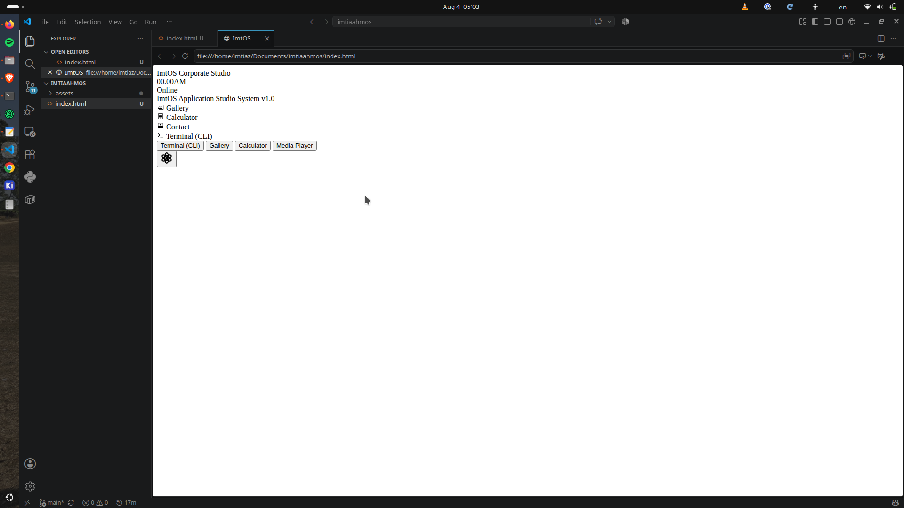
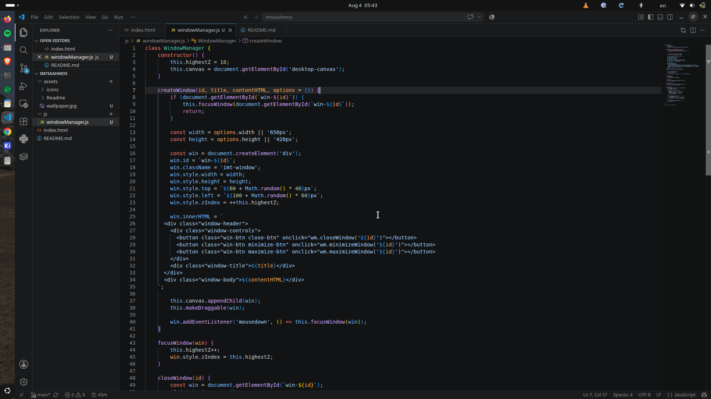
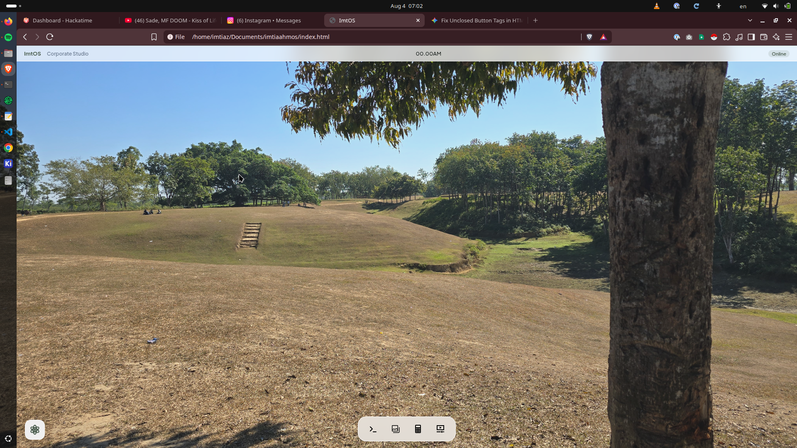
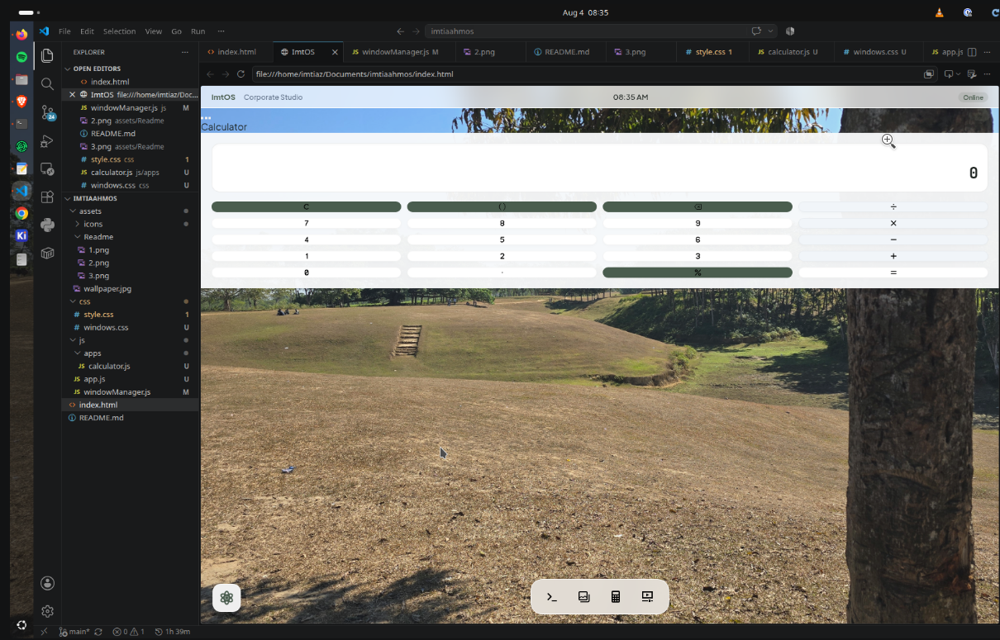
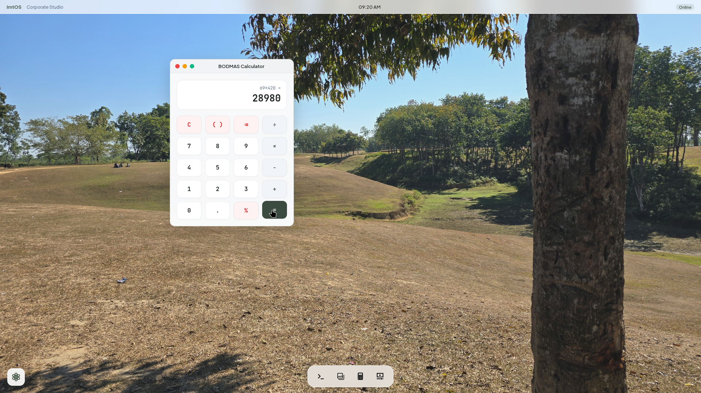

# ImtOS by Imtiaz Ahmed

Yo, It's Imtiaz Ahmed, 15, building **ImtOS**, which is basically a WebOS that can be run on browser.
Using ImtOS, you can easily get to know me! That starts now!

## Day-1, Aug 4, 2026.

**Log-1, Hackatime Coding Session: 19Minutes**

Today, i created the main thing where everything will be shown, the **index.html** file. In this ImtOS, we gonna have 4 different applications.
They are
- **Calculator**
- **Gallery**
- **Media Player**
- **Terminal (CLI)**

As you can see in the picture given above, i created the base. There will be a dock with 4 svg icons that represents those 4 applications. There will also be an atom icon which I made myself will work as an application centre. In the next mission, I'm thinking of adding more features without bothering the dock, so those apps will go here.

**Log-2, Hackatime Coding Session: 21Minutes**

Now, I created the **windowManager.js**. It's crucial cause while using the OS and its features, the OS creates Windows. Although we haven't designed the OS or styled it yet, it's so important, cause without it, i can't create any windows. 
So, now I'll create the **style.css** file.

**Log-3, Hackatime Coding Session: 39Minutes**

I've created the **style.css** file and designed the dock and the application centre. I also designed the top header that says ImtOS - Corporate Studio and how it'd react. That's it all in **style.css**, now it's time to create some actual apps. Starting with the **calculator** app.

**Log-4, Hackatime Coding Session: 83Minutes**

As you can see in the given picture above, the calculator looks hella odd. I created **windows.css** and **calculator.js** for that. But, It was looking that and it was pissing me off. It wasn't even draggable. And It had no bar in it. Then I created an whole section in **style.css** for window and that lwk worked.

This worked. Now, you may be thinking that why are you gonna use the calculator function in ImtOS when you have a calculator in your hand or calculator app in your device. This is a great question to think. So great even idk the answer.

Whatever, use it or don't, this feature is awesome (pls say yes).
